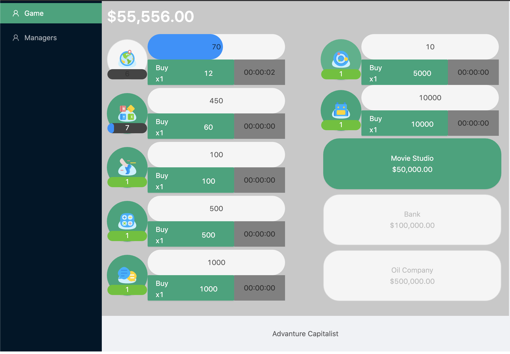
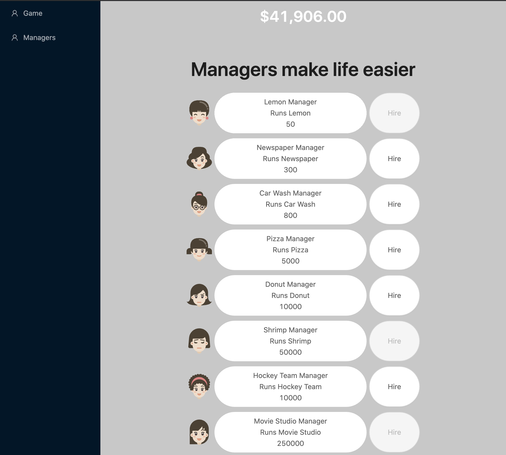
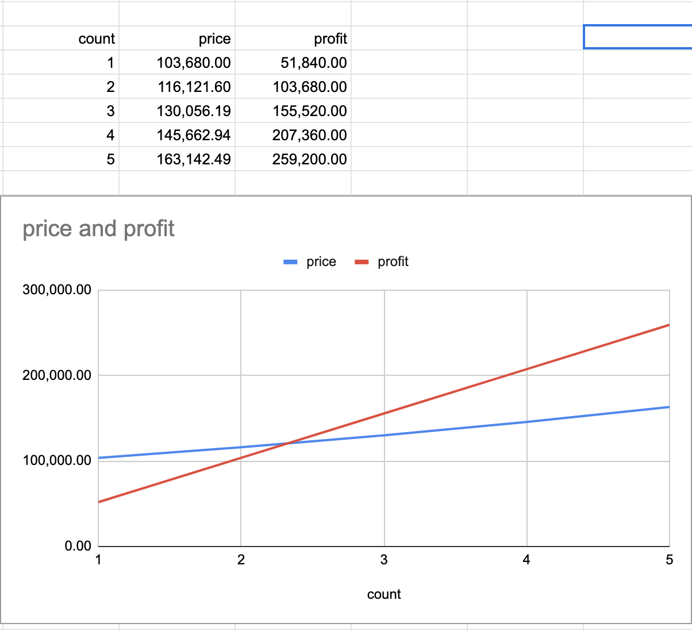

# Adventure capitalist

[Click to earn game](http://en.gameslol.net/adventure-capitalist-1086.html) clone

http://46.101.171.160:3000/ (valid until August 1st 2020)

|           Game Screen           |           Managers screen           |
| :-----------------------------: | :---------------------------------: |
|  |  |

## Overview

- Buy and upgrade businesses. There should be several business types to choose from.
- Make money from a business. (i.e. you click on a business and in a certain amount of time you get money - see web implementation above.)
- Hire managers, so that money is made automatically.
- When you close the game, next time you open it, you should see the money that your businesses made for you. (Businesses continue to make progress while you’re away.)

## Detailed Requirements

[requirement](/docs/Game Closure Coding Challenge\_ Adventure Capitalist.pdf)

<details>
<summary>Development Process</summary>

### 1. Research

By inspecting source game found out few pieces of information

1. game not sending network requests on action

   - reference game not sending request if I leave idle
   - not sending network request even if I buy the business

2. probably reference game using the unity web
   Not sure about recent unity Web build but reference game's indexedDB key name is `/idbfs/PlayerPrefs`. And its unity's default PLayerPrefab saving location.

3. reference game saves data every 30 seconds

4. if I change the browser tab without closing the reference game tab, the timer stops

5. reference game doing user identification at the client level
   if I clear cache and relead my data clears and game start fresh

6. some interesting console.logs

   If I leave the game and comes back this console.log can be viewed. It seems the game is recalculating idle earned money on game start

   ```console.log
   Time elapsed since going offline: [13.5520000457764]

   webgl.js:1 Profit surge on [lemon] for time [13.5520000457764]     results in the venture completing [361] times, earning [253422]

   webgl.js:1 Profit surge on [news] for time [13.5520000457764]     results in the venture completing [18] times, earning [259200]
   ```

7. Business prices and profits are increasing linearly.
   Based on the donut shop price and profit
   after a few minutes of checking, I found that price and profits are increasing linearly.

   | count | price      | profit     |
   | ----- | ---------- | ---------- |
   | 1     | 103,680.00 | 51,840.00  |
   | 2     | 116,121.60 | 103.680.00 |
   | 3     | 130,056.19 | 155,520.00 |
   | 4     | 145,662.94 | 207,360.00 |
   | 5     | 163,142.49 | 259,200.00 |

   

</details>

## Decisions

These are some of the decisions I made during development

### Functions

- Not to implement tutorial

  There is no reason to omit tutorial except limited time. If I release this POC to real users, I have to implement a tutorial right away. For now, I assume reviewers and contributors are aware of the requirement. Then I am not implementing a tutorial.

  pros:

  - simple logic
  - less development time

  cons:

  - game is not understandable to first-time users

- Not to implement user login

  Like a reference game, I am saving user ID locally. Since I assume I can trust local data during POC, there is no need to have a login procedure.

  pros:

  - user can access the game without login step.

  cons:

  - Users can't use multiple devices.
  - user can lose data if they clear cache

- Not to implement special manager functionality

  The reference game has some special managers who increase profits by 10%. In this POC I am only including managers who run a business

  pros:

  - game logic would be simple

  cons:

  - game functionalities would be few

### Technology

`Unity` and `Construct 2` are out of option. Because JS is required to be used. (Actually, Unity has JS option. But I don't think that is the point of requirement)
Mostly due to the limited time, I am using the technical stacks I am familiar with. In production, the game should not be created with HTML/CSS. Because their frame rate is very low. It has been almost 3 years since last I wrote an HTML5 game. I am not sure wheter old HTML5 framework I had used (MelonJS) is still usable.

- Using `Create React App` for frontend

  If we create games on HTML, SSR is not for games. So CRA is the most straight forward way to create a single-page app. `VueJS` is an another alternative. But I have limited experience with `VueJS`.

- Using `Ant Design` for Component Library

  In a limited time, not reinventing the wheel is an important part. Some functionalities like Layout, Button will save some time with the cost of `game-like UI/UX`. But when I choose HTML as frontend I left `game-like UI/UX` out.

- I have a few boilerplates. But not using them because

  - some stacks are old
  - some things are overcomplex for this simple app

- To use `graphql`

  I am not expecting much loads. Since it is POC, I am going to try and update APIs a lot. A simple graphql server is an excellent choice for this case.
  This decision bring `Apollo` as frontend client.

- Using Nexus + Prisma for backend

  Because I have some experience with these technologies and they are very easy to up and run graphql server.

- Using `MySQL` as a database

  - on POC I don't need a Cloud database.
  - prisma 2 only supports SQLite and MySQL ( for now )

- phpMyAdmin

  Its just a database check tool. Anything would be OK.

### Maintenance

- No to use a `load-balancer`

  POC not expecting heavy load. So load-balancer is excluded

- Not to save a log.

  The game is for POC purpose. So I am not doing whole maintenance development. Also not to use createdAt, updatedAt, deletedAt on database records. Because they are mostly used for debugging

- No alerts

  Since this game is for POC purpose, I am not implementing monitoring and alert

- No tests

  The game is small. And I am not going to maintain it long term

## Service debts

There are a lots of ideas to improve this product. Some of the concerns I have:

- Implementation of reference game functionalities

  - User Profile / Status
  - Bulk buy company
  - AdVentures
  - Upgrades
  - Investers
  - Special managers
  - Animations

- Need to improve game balance

  Currently, all business prices and profits are not finalized, and buying "Lemon Business" is more productive. Need to improve numbers in the future

- Sound
  - BGM
  - Effect

## Technical debts

All engineering projects have technical debts. Most of them are intentional but not fixed. Because it requires resources to fix them.

- Encrypt frontend data and request

  Currently, frontend data is saved to `localstorage` without encryption

- Better user recognition

  Need to use token-based auth like jwt

- Duplicated code

  Both back and front end contain a lot of duplicate codes. Leaving them duplicated mostly due to time factor.

- Backend refactoring

  Due to simplicity, I implemented all Query/Mutation in single file `schema.js`. If I implement more actions or decide to move to long term maintenance, I have to restructure backend folders

- Minimize network requests

  In limited time, My implementation was to send a network request every time the user/manager does action. It is a very bad implementation. I need to implement something similar to the reference game. For example summarizing money at the frontend with encryption. Sending data to backend every 30 seconds.

- Make docker image smaller

  Currently, I am running the docker process as `ts-node`. Need to change it to `node`. After that also need to build the image with `npm install --production`

- Things needed to be implement

  - register/login
  - save data button
  - transfer fund
  - ...

## Contribution

Endpoints are hardcoded for docker deployment. Change them to `localhost` for development

```sh
# MySQL and phpMyAdmin
docker-compose up -d
# new terminal
cd backend;
npm install;
npm run dev
# new terminal
cd web;
npm install;
npm start
# new terminal
cd backend
npm run migrate-save
npm run migrate-up
npm run seed
```

Now we can access

- Frontend : http://localhost:3000
- Backend : http://localhost:4000/playground
- phpMyAdmin : http://localhost:8080

## Deployment

1. clone the repository to your server
2. start containers

   ```sh
   docker-compose -f docker-compose_prod.yaml up -d
   ```

3. connect to game_backend container

   ```sh
   docker ps
   docker exec -it <container_id> bash
   ```

4. prepare migration files

   ```sh
   npm run migrate-save
   ```

5. migrate the database

   ```sh
   npm run migrate-up
   ```

6. insert initial businesses

   ```sh
   npm run seed
   ```
